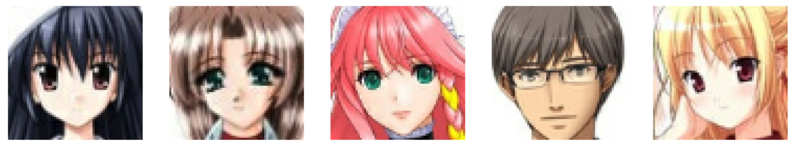

# Creating-anime-characters-using-DCGANs-and-Keras
## Nama Pengumpul: Dheo Putranta Pandia
## Nama Tugas:Creating anime characters using DCGANs and Keras
## Learning Path: Advance AI (Infinite Learning)

# Pembuatan Karakter Anime dengan DCGANs dan Keras

## Deskripsi Proyek
Proyek ini bertujuan untuk menggunakan Deep Convolutional Generative Adversarial Networks (DCGANs) untuk membuat karakter anime secara otomatis. Dengan menggunakan teknik pembelajaran mesin ini, kita dapat menghasilkan karakter anime baru yang unik dan menarik.

## Langkah-langkah Proyek

1. **Memahami GANs**: Mulailah dengan memahami dasar-dasar Generative Adversarial Networks (GANs), termasuk cara kerjanya dan arsitekturnya.

2. **Eksplorasi DCGANs**: Pelajari lebih lanjut tentang Deep Convolutional Generative Adversarial Networks (DCGANs), yang dirancang khusus untuk tugas pembangkitan gambar.

3. **Persiapan Dataset**: Kumpulkan dataset karakter anime yang akan digunakan untuk melatih model DCGAN.

4. **Pra-Pemrosesan Data**: Pra-pemrosesan dataset untuk persiapan pelatihan, termasuk normalisasi dan resizing gambar.

5. **Bangun Generator dan Diskriminator**: Implementasikan jaringan generator dan diskriminator menggunakan Keras.

6. **Kompilasi Model**: Kompilasi model generator dan diskriminator dengan fungsi kerugian dan pengoptimal yang sesuai.

7. **Pelatihan DCGAN**: Latih model DCGAN menggunakan dataset yang sudah dipersiapkan.

8. **Evaluasi Hasil**: Evaluasi karakter anime yang dihasilkan secara visual dan kualitatif.

9. **Penyetelan Model**: Setel ulang model DCGAN sesuai kebutuhan untuk meningkatkan kualitas gambar yang dihasilkan.

10. **Generasi Karakter Anime**: Gunakan model DCGAN yang sudah dilatih untuk menghasilkan karakter anime baru.

11. **Iterasi dan Perbaikan**: Iterasi terus menerus pada model dan dataset untuk meningkatkan kualitas dan keragaman karakter anime yang dihasilkan.

## Dependensi
- Python 3.x
- TensorFlow
- Keras
- Matplotlib
- NumPy

## Cara Penggunaan
1. Instal dependensi yang diperlukan dengan menjalankan `pip install -r requirements.txt`.
2. Siapkan dataset karakter anime dan letakkan dalam folder yang sesuai.
3. Jalankan notebook Jupyter atau script Python untuk melatih model DCGAN.
4. Evaluasi hasil dan gunakan model untuk menghasilkan karakter anime baru.

## Kontribusi
Kontribusi terhadap proyek ini sangat dipersilakan. Silakan buat *pull request* dengan perbaikan atau tambahan fitur.

